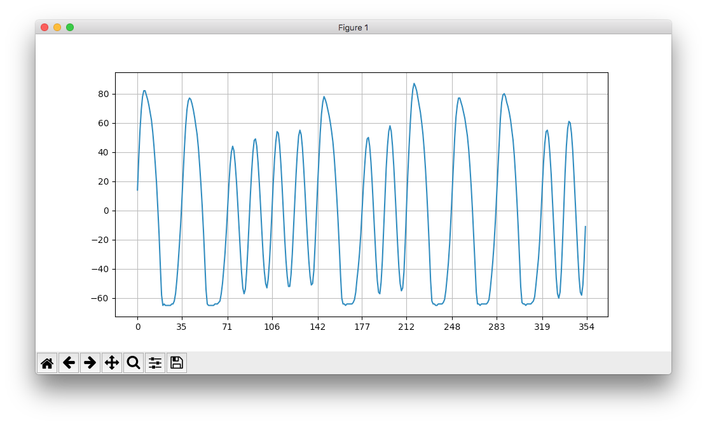
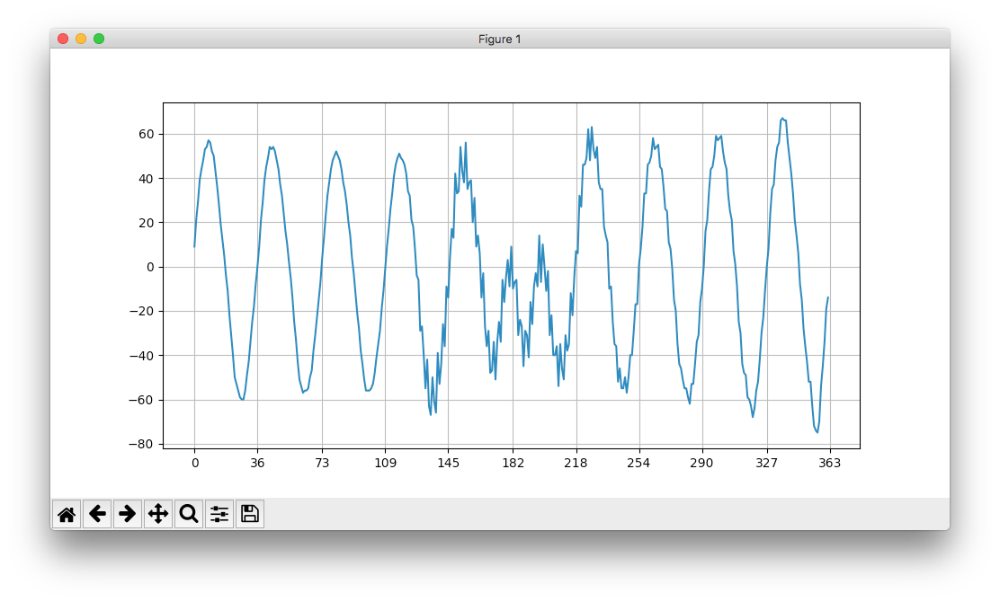
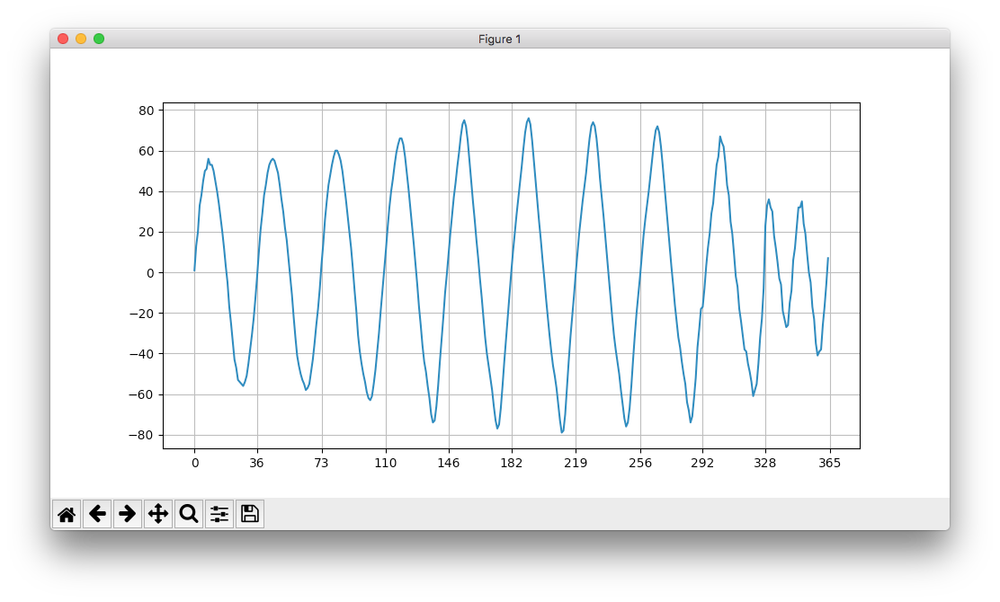
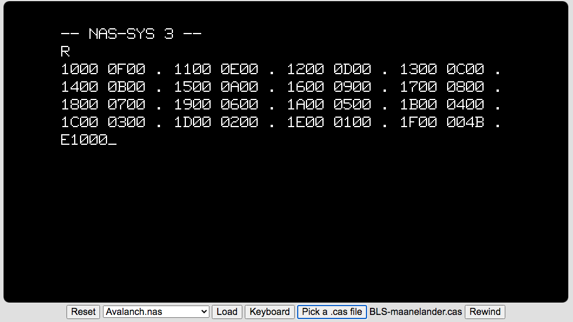
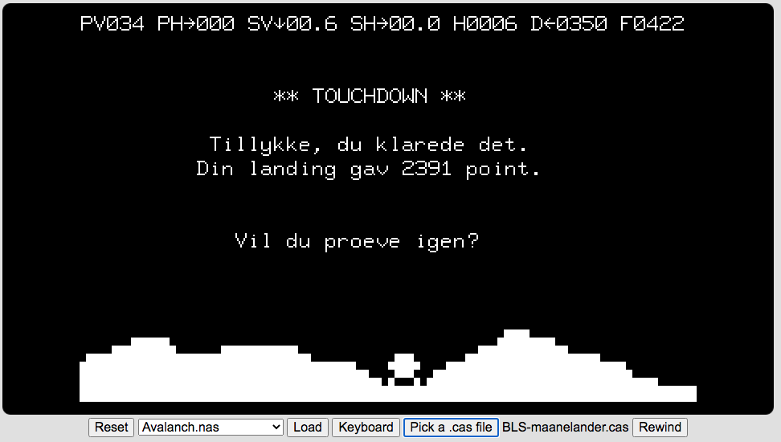

# Nascom Tape Data Utilities
This repo contains python scripts that will convert between the various formats for data stored on Nascom cassette tapes.

## Supported formats

- **`.wav`**: Standard .wav file format. Currently, 8-bit unsigned frame values are supported.  I've tested the script with 44.1kHz framerates.
- **`.cas`**: Binary format with bytes stored in the NAS-SYS block format. See the description of the 'W' NAS-SYS command in the [NAS-SYS manual](http://nascomhomepage.com/pdf/Nassys3.pdf) for details.  The simulator is able to use the data from here for the NAS-SYS 'R' command.
- **`.nas`**: Ascii format with lines containing a 4 digit hex address followed by 8 2 digit hex bytes.  Alternatively, this format also supports the output from the 'T' (tabulate) command.
- **`.asm`**: Ascii text.  Suggested file extension for NAP assembly source text.

## Scripts

There are currently three scripts:

### wavcas.py

Converts a .wav file to a .cas file.

**Syntax:**
```
Invocation:
  wavcas.py [-?][-v][-s][-p n] <input file> <output file>

where:
  -?    Prints this information
  -v    Turns on verbose mode
  -s    Turns on silent mode
  -o    Use offset adjust per bit
  -n n  Noise reduction window size
  -f n  Expected frames per bit
  -t n  Number of stop bits (1 or 2). Default: 1
  -p n  Plots the input wav data for byte n. n can be specified as hex (0xnn) or decimal
```

**Examples:**

The first example doesn't require any special options for correct conversion

```
$ python wavcas.py -p 500 BLS-maanelander.wav BLS-maanelander.cas
Determining frames per bit...
Frames per bit after 4000 samples: 35.3075. Last sample at: 4.58320s. Real baud rate: 2498.
Finding all start bits...
Found 4564 start bits, First: 1.26934s, Last: 39.90474s
Converting bits to bytes...
Number of bytes: 4513
Writing to output file: BLS-maanelander.cas...
01F4: 0011010001 16, sampled at: 5.31580s
```
In addition to converting the .wav file, a plot of the wav data for byte 500 is shown.  This might come in handy if you have problems generating a valid .cas file.


The second example requires use of noise reduction (-n 3) and offsetting (-o).  This recording was done using the built-in line (3.5mm jack).

```
$ python wavcas.py -n 3 -o BLS-nap-ram-v22.wav BLS-nap-ram-v22.cas
Reducing noise...
Determining frames per bit...
Frames per bit after 4000 samples: 37.0635. Last sample at: 6.89293s. Real baud rate: 1189.
Finding all start bits...
Found 4688 start bits, First: 4.44252s, Last: 43.63129s
Converting bits to bytes...
Number of bytes: 4687
Writing to output file: BLS-nap-ram-v22.cas...
```

The plot of the raw data before noise reduction and offsetting looks as follows.  Notice, that there are more zero crossings than expected, which confuses the rest of the algorithm for detecting the zeros and ones.  Also the negative and positive peaks for the 1-bit is not centered around the 0 y-axis value.


The plot after noise reduction (-n 3) and offsetting looks as follows:


### nascas.py

Converts between .nas and .cas formats.  The script converts both ways; if the input file is a .cas file a .nas file is produced and vice versa.

**Syntax:**
```
Invocation:
  nascas.py <input file> <output file>
```

**Example:**
```
$ python nascas.py BLS-maanelander.cas BLS-maanelander.nas
Converting CAS to NAS
```

### casasm.py

Converts a .cas file, saved from NAP with the 'W' command, to ascii text.  Can be used to verify assembly source.

Currently, the output goes to standard out.

TODO: Make it possible to convert the other way, i.e. assembly source to the .cas format used by NAP.

**Syntax:**
```
Invocation:
   casasm.py <input-file>
```

**Example:**
```
$ python3 casasm.py skakur.cas >skakur.asm
```

For a complete example see: [Examples](examples)

## Testing

The generated .cas files can be tested in the web-base simulator available here: [Virtual Nascom](https://PeterJensen.github.io/virtual-nascom/virtual-nascom.html).

You'll need to pick the generated .cas file as tape input.  Issue the 'R' command to simulate reading it from tape, and start executing from address 0x1000 with the 'E1000' command.

The BLS Super Maanelander game is awesome!

Here's a couple of screenshots from the simulator


