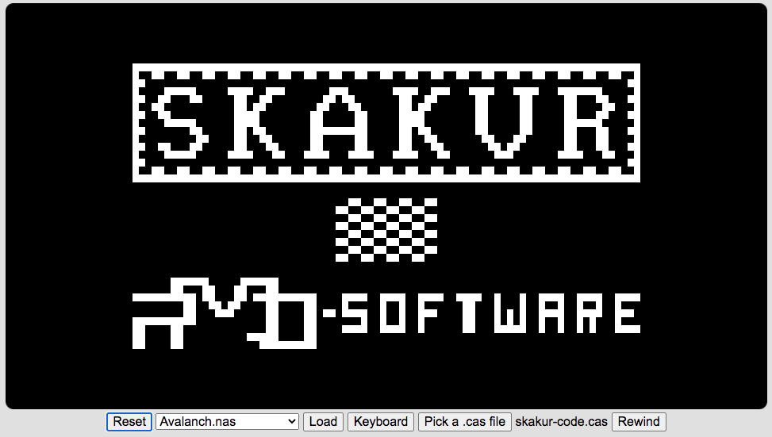

# Examples
This directory contains a few examples of retrieval of old casette tape programs, stored in variuos formats:

## NAP Assembly format

I found the source for an old assembly program, I had written using the NAP assembler.

The source was written to tape from within NAP with the 'W' command. This format is a semi compressed format where sequences of spaces are encoded as one byte with bit 7 set to 1, and bit 0-6 indicating the number of spaces (+1).  Each line begins with 6 zeros and is terminated by CR (0x0d) and a checksum

Here's the steps I used to get to a binary file that can be loaded with the NASSYS 'R' command, or alternatively loaded into memory from a .nas file.

1. Convert the .wav file to a .cas fil
   ```
   $ python3 ../wavcas.py -n 5 skakur.wav
   ...
   Writing to output file: skakur.cas...
   ```
2. Convert the .cas file to assembly source text, and inspect that it looks valid
   ```
   $ python3 ../casasm.py skakur.cas >skakur.asm
   ```
3. Bring up the Nascom-2 simulator and load the NAP assembler.  Load the newly generated .cas file from within NAP with the 'R' command
4. Assemble the source with the 'A' command.
5. Exit to NASSYS (Q NAP command)
6. Run the program with the E7000 NASSYS command
7. Write the machine code for the assembled program to tape with the 'W7000 7620' command
8. Copy the file serialout.txt to skakur-code.cas

